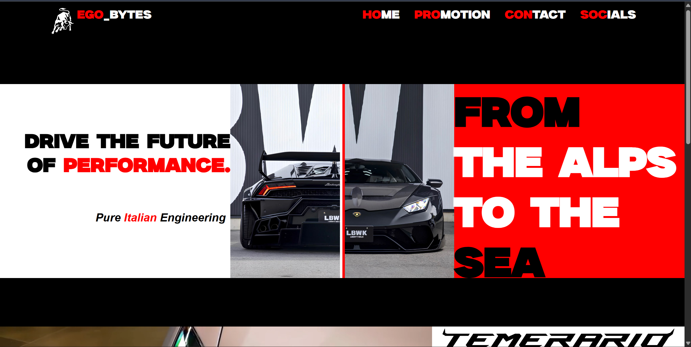
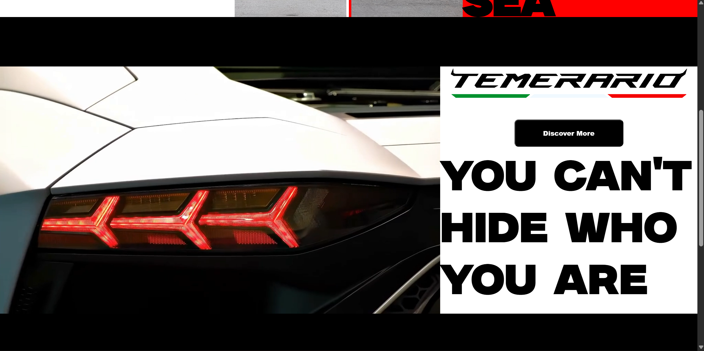
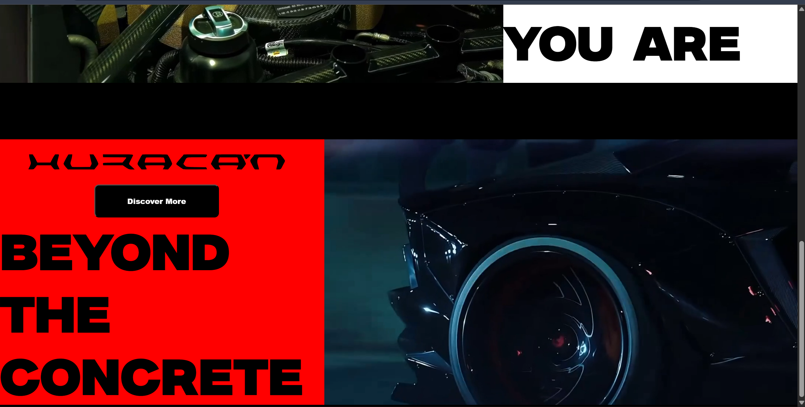

# 🚀 Frontend Project

This is a simple **frontend-only** project built using **HTML** and **CSS**.  
Currently, it focuses on the **UI/UX part**, while backend functionality will be added in the future.  

---

## 🖼️ Project Preview

<p align="center">
  
</p>

<p align="center">
  
</p>

<p align="center">
  
</p>

---

## 📌 Features
- Clean and responsive design  
- Built with pure HTML and CSS (no frameworks used)  
- Easy to customize and extend  
- Lightweight and fast  

---

## 🛠️ Tech Stack
- **HTML5**  
- **CSS3**  

---

## 📂 Project Status
✅ Frontend completed  
🔜 Backend will be integrated soon  

---

## ⚡ Getting Started
1. Clone the repository  
   ```bash
   git clone https://github.com/your-username/your-repo-name.git
